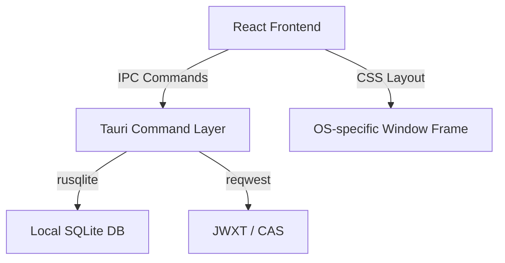

# Grade Desk 开发者文档 (Developer Guide)

欢迎来到 Grade Desk 桌面端应用程序的开发文档！本项目是一个专为大学生设计的**本地优先 (Local-first)、隐私安全**的成绩管理与分析桌面客户端。

> [!IMPORTANT]
> **免责声明 (Disclaimer)**：
> 本项目是一个独立开发的开源成绩管理工具，仅供个人学习、学业分析与学术研究使用。**本项目与任何高校或官方教务机构无任何关联，非官方发布软件。** 软件中涉及的教务对接机制仅在本地运行，请在遵守所在学校网络及系统使用规范的前提下使用。

---

## 1. 架构设计与技术栈

本项目采用前后端分离的现代化桌面开发架构：

- **前端 (Frontend)**: React + Vite + TypeScript + Vanilla CSS。
- **后端 (Backend)**: Rust (Tauri 2 运行时框架)。
- **本地存储**: SQLite (通过 Rust 端 `rusqlite` 管理，驱动使用 `bundled` 静态编译)。
- **教务对接**: 基于 Rust 调用的受控浏览器 WebView 登录和请求适配器，确保教务认证 Cookie 不落盘、不上传。

### 架构示意图


---

## 2. 目录结构说明

```text
├── .github/                 # GitHub Actions 工作流 (CI/Release)
├── docs/                    # 项目设计与模块文档
│   ├── modules/             # 功能模块的独立文档 (包含设计细节、安全模型等)
│   └── developer-documentation.md # 开发者文档 / 路线图与规范 (即本文件)
├── src/                     # 前端 React 源码
│   ├── main.tsx             # 应用入口及平台初始化逻辑
│   └── styles.css           # 核心样式表 (包含多平台原生窗口适配)
├── src-tauri/               # 后端 Rust Tauri 源码
│   ├── capabilities/        # Tauri 安全权限配置
│   ├── src/                 # Rust 核心逻辑 (数据存储、教务会话、日志等)
│   ├── Cargo.toml           # 后端依赖管理
│   └── tauri.conf.json      # Tauri 配置文件
└── package.json             # 前端依赖配置
```

---

## 3. 本地开发环境搭建

### 前置准备

请确保本地已安装以下环境：
1. **Node.js** (LTS 版本)
2. **pnpm** (项目唯一指定前端包管理器)
3. **Rust 工具链** (MSRV 1.75+)

#### 平台特有依赖 (编译 Tauri 必选)
- **macOS**: Xcode Command Line Tools (`xcode-select --install`)
- **Windows**: WebView2 运行时 (Windows 11 已内置)。教务登录窗口必须经由异步 Tauri command 创建，以避免 WebView2 在同步窗口创建时死锁。
- **Linux (Ubuntu/Debian)**:
  ```bash
  sudo apt-get update
  sudo apt-get install -y libwebkit2gtk-4.1-dev libappindicator3-dev librsvg2-dev patchelf
  ```

#### 平台支持边界

- **macOS / Windows 11 / Linux**：支持本地成绩管理和受控 JWXT/CAS 登录。Windows 会话文件使用当前用户的 DPAPI 加密；Unix 平台的会话文件权限设为 `0600`。
- **Linux**：为兼容不同桌面合成器，原生窗口不使用透明效果。登录依赖 WebKitGTK，首次发布前必须在实际 Linux 桌面环境验证 CAS 跳转与 Cookie 持久化。

### 开发指令

1. **安装前端依赖** (严禁引入 `npm`/`yarn`/`bun` 的 lockfile):
   ```bash
   pnpm install
   ```

2. **启动本地开发环境** (包含前端 HMR 和 Tauri 调试窗口):
   ```bash
   pnpm tauri dev
   ```

3. **执行静态检查与构建校验** (CI 验证的核心步骤):
   ```bash
   # 前端构建验证
   pnpm build
   # Rust 编译验证
   cargo check --manifest-path src-tauri/Cargo.toml
   ```

4. **生产发布包编译** (将在 `src-tauri/target/release/bundle/` 下生成当前平台的安装包):
   ```bash
   pnpm tauri build
   ```

---

## 4. 核心设计规范与原则

### 4.1 隐私与安全约束 (Security Guardrails)
- **零网络凭证泄露**：前端**不得**接触用户的 CAS 密码、登录 Cookie 或 Session 凭证。所有敏感交互必须封装在 Rust 层的受控 WebView / 适配器中。
- **本地优先存储**：数据默认仅保存在本地 SQLite 数据库中。删除本地档案操作将完全物理抹除本机数据库，且不可逆。
- **只读教务同步**：写入本地的数据仅作学业分析，应用不提供任何修改教务系统线上数据的写入接口。

### 4.2 窗口与 UI 样式规范 (Window & UI styling)
- **全局 Apple 页面风格**：按钮形状 (Capsule)、卡片圆角 (`18px`)、列表圆角 (`11px`)、主要字体栈（优先 SF Pro / 微软雅黑）及深蓝强调色（`#0066cc`）等**在所有系统上完全一致**。
- **原生窗口边框适配 (Platform-Native Window Frame)**：
  - **macOS**：无系统标题栏，Traffic Lights 融入左侧 Sidebar。
  - **Windows & Linux**：采用操作系统原生标题栏与窗口控制按钮，前端自动隐藏自定义标题栏 (`.context-nav`) 并重置 Sidebar Padding。
  - **Linux 兼容性防护**：对 Linux 系统下的背景和 Sidebar 强制使用不透明色，避免合成器兼容透明导致的黑屏/异常 Bug。

---

## 5. 功能模块文档索引

每个主要子功能模块都在 [`docs/modules/`](modules/) 下拥有独立的设计文档，开发前请务必阅读对应说明：

- [应用外壳与基础配置](modules/app-shell.md) (`app-shell.md`): Tauri 2 窗口管理。
- [成绩持久化仓库](modules/grade-repository.md) (`grade-repository.md`): SQLite 迁移、种子数据及数据库结构。
- [成绩概览与主看板](modules/grade-dashboard.md) (`grade-dashboard.md`): 只读 UI 表格和绩点统计。
- [历史版本与归档流程](modules/archive-workflow.md) (`archive-workflow.md`): 本地快照、成绩变动追踪与数据导出。
- [教务认证与数据抓取](modules/jwxt-session.md) (`jwxt-session.md`): 受控 CAS 登录与数据抓取设计。
- [系统日志与诊断](modules/logging.md) (`logging.md`): Rust 端的结构化日志管理。
- [跨平台兼容与自动化流水线](modules/ci-release-compatibility.md) (`ci-release-compatibility.md`): 样式覆盖细节及 GitHub Actions CI/Release 机制。
